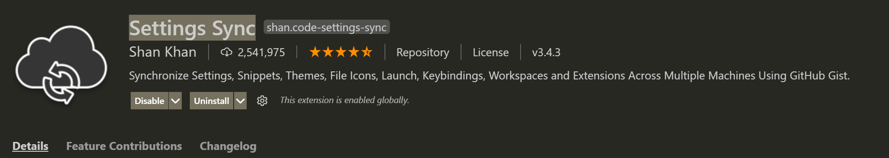
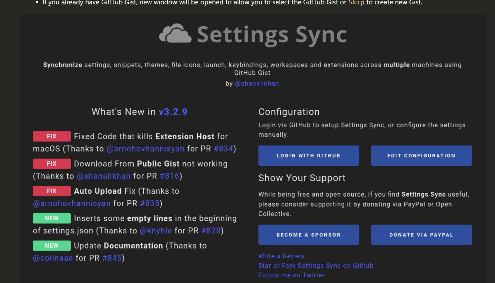

# vscode同步配置
- 现在vscode做为一个非常重要的开发工具,已经成为了我日常开发中，必不可少的工具。为了使用它强大的功能，我这里会做很多配置，安装很多插件。但是某种换了系统或重新安排vscode，这些配置要全部来一遍，非常的痛苦。
这个时候有一个插件解决了这个问题，这件插件就是：Settings Sync，如下图所示：
  
  
- 这个不足的地方就是这个需要一个github账号，但是我们国家的现在的环境，访问github会有很多问题。还好，它有时可以用，有时不可以用，看你运气了。
- 备份的内容:
```text
All extensions and complete User Folder that Contains
1. Settings File
2. Keybinding File
3. Launch File
4. Snippets Folder
5. VSCode Extensions & Extensions Configurations
6. Workspaces Folder
```
- 特性
```text
1. Use your GitHub account token and Gist.
2. Easy to Upload and Download on one click.
3. Show a summary page at the end with details about config and extensions effected.
4. Auto download Latest Settings on Startup.
5. Auto upload Settings on file change.
6. Share the Gist with other users and let them download your settings.
7. Supports GitHub Enterprise
8. Support pragmas with @sync keywords: host, os and env are supported.
9. GUI for changing settings / logging in
10. Allows you to Sync any file across your machines.
```
## 使用步骤
### 中文安装描述
- 搜索Setting Sync并安装
- 安装完成后，在插件列表找到这个插件，在详情介绍里面，点"LOGIN WITH GITHUB",如下图
  
- 这个时候，会打开默认浏览器访问github的登录界面。
- 完成登录后，就可以上传配置或下载配置了。
- 它会配置备份你的所有配置和插件。恢复的时候，会把所有插件都会给你安装。

### 官方安装描述
- Click on Login with GitHub .
- Login GitHub on Browser and close the browser tab once you get Success message.
- If you are using Settings Sync first time GIST will be created automatically when you upload your settings.
- If you already have GitHub Gist, new window will be opened to allow you to select the GitHub Gist or Skip to create new Gist.

## 快捷键
```text
1. Upload Key : Shift + Alt + U
2. Download Key : Shift + Alt + D

(on macOS: Shift + Option + U / Shift + Option + D)
```
