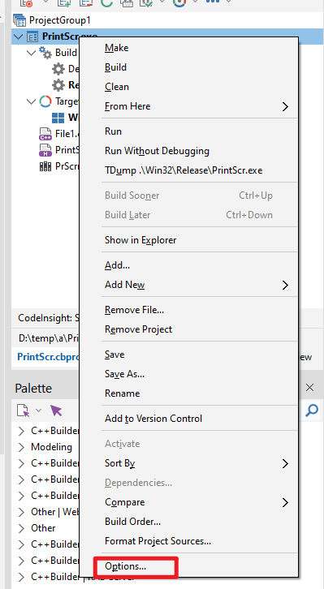

# 使用微信PC端的截图dll库实现微信截图功能(C++ Builder实现)
- 网上有很多文章说“使用微信PC端的截图dll库实现微信截图功能”，我用node实现截图也要用一下，于是找到这个
https://github.com/liangtongzhuo/electron_screenshot 这个是用node调用PrintScr.exe，PrintScr又是调用PrScrn.dll。结果是直接可以用，但是需要安装一个.net 3.5的库
- 我想要一个绿色的版本的。于是相到用C++ Builder实现一个调用这个dll的命令行程序。

## 生成C++Builder需要的lib 
- 这个PrScrn.dll是一个32位的dll，可以直接用C++Builder自带的工具implib生成dll对应的lib
- 如果是64位的dll，就不能用implib, 要用别的。
```bat
implib PrScrn.lib PrScrn.dll
```
- 查看一下，这个dll有哪些接口
```bat
tdump -ee -m PrScrn.dll
```
输出如下：
```text
Turbo Dump  Version 6.6.1.0 Copyright (c) 1988-2021 Embarcadero Technologies, Inc.
                    Display of File prscrn.dll

EXPORT ord:0001='PrScrn'
```
可以看到，这个dll只有一个函数PrScrn

- 还可以用命令生成def文件
```bat
impdef PrScrn.def PrScrn.dll
type PrScrn.def
```
输出如下：
```text
LIBRARY     PRSCRN.DLL

EXPORTS
    PrScrn                         @1   ; PrScrn
```

## 启动C++Builder 创建控制台工程 如下步骤

- 第一步

- 第二步

- 第三步


- 第四步：另存工程， 工程名称存为PrintScr


- 第五步：工程右键菜单选择options


- 第六步：除动使用dll，使它可以独立成exe，不依赖C++Builder的任何dll


调成false，保存就可以了

第七步：将PrScrn.lib复制到工程目录下面，将PrScrn.dll复制到Win32/Release目录下面
然后右键工程，选择add项, 将lib加到工程里面


第八步：修改main函数
```C++
#pragma hdrstop
#pragma argsused

#ifdef _WIN32
    #include <tchar.h>
#else
typedef char _TCHAR;
    #define _tmain main
#endif

#include <stdio.h>
// 外部的dll函数申明
extern "C" int __stdcall PrScrn();

int _tmain(int argc, _TCHAR* argv[])
{
    return PrScrn();
}

```
第九步：选择release方式运行，成功启动截图。
- 这样会得到PrintScr.exe, 将这两个放到一起，就是一个绿色的截图工具，成功后，截图就是剪切板里。在wps新建文档下，按ctrl + v，就能看到你的截图了