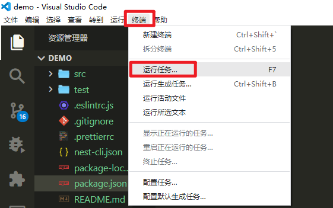
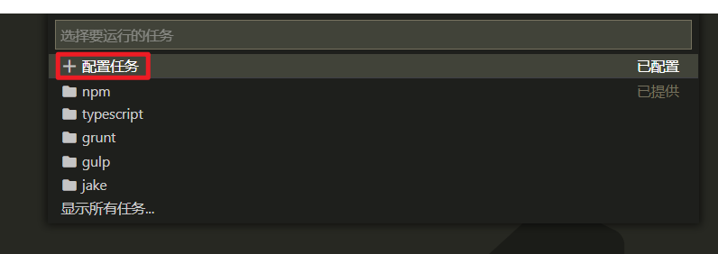
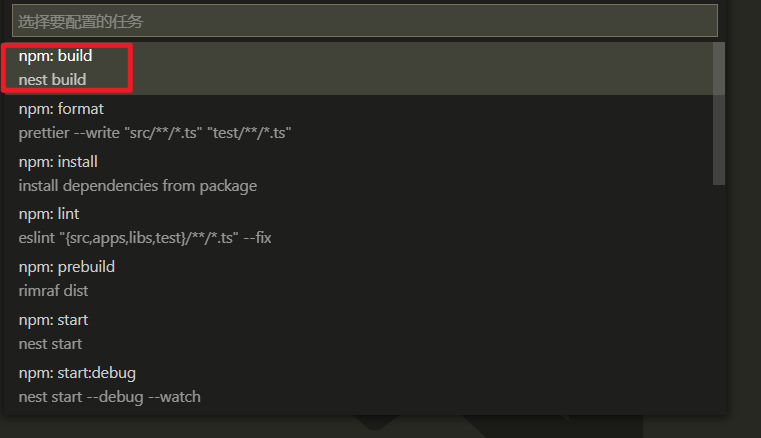
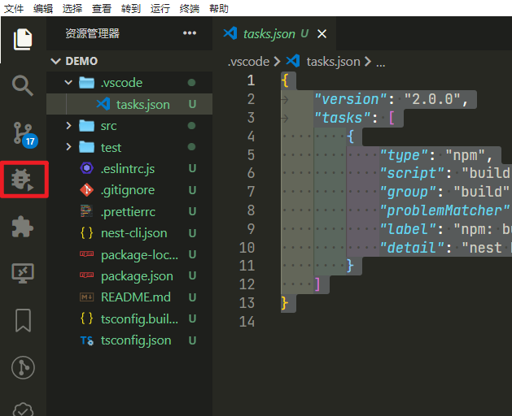
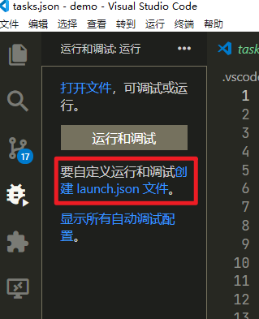
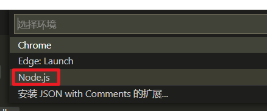

# nestjs笔记一：创建工程
## 环境准备
### 1.准备好node环境
去www.nodejs.org下载一个node版本安装。这里就不说了
### 2.准备好nestjs环境
在命令行输入：
```bat
npm i -g @nestjs/cli
```
完成后，nest的cli工具就可以用了
## 创建工程
```bash
# 在命令行下，创建一个叫demo的工程
nest new demo
# 在选择npm, yarn等时候，选择你喜欢的
# 创建完成后，当就目录就多了一个demo目录，这样就完成工程的创建
# 然后进入demo目录
# 如果在创建的时候，卡死了，那就按ctrl+c退出，手动输入npm install
```
## 配置vscode开发环境

### 启动vscode
```bash
# 进入demo目录，启动vscode
cd demo
code .

# 或在已启动的vscode打开这个目录
```
### 配置任务
1.vscode 菜单->终端->运行任务



2.在任务列表下拉框选择：配置任务



3.在要选择的配置任务列表，我们这里选择npm: build
注:这些都是package.json中script中的东西



然后就会创建一个任务文件，在.vscode目录下录  tasks.json
内容如下：
```json
{
	"version": "2.0.0",
	"tasks": [
        {
            "type": "npm",
            "script": "build",
            "group": "build",
            "problemMatcher": [],
            "label": "npm: build",
            "detail": "nest build"
        }
    ]
}
```
这样完成了任务的配置
### 配置启动
1.在左侧工具栏，选择调试



2.选择创建launch.json



3.选择运行环境列表，选择node



4.然后如下配置
```js
{
    // 使用 IntelliSense 了解相关属性。
    // 悬停以查看现有属性的描述。
    // 欲了解更多信息，请访问: https://go.microsoft.com/fwlink/?linkid=830387
    "version": "0.2.0",
    "configurations": [
        {
            "type": "pwa-node",
            "request": "launch",
            "name": "Launch Program",
            "skipFiles": [
                "<node_internals>/**"
            ],
            "program": "./dist/main.js" //默认这个是{file}，这里要改成这个main.js就可以启动调试
        }
    ]
}

```
5.配置任务和输出终端后，如下
```js
{
    // 使用 IntelliSense 了解相关属性。
    // 悬停以查看现有属性的描述。
    // 欲了解更多信息，请访问: https://go.microsoft.com/fwlink/?linkid=830387
    "version": "0.2.0",
    "configurations": [
        {
            "type": "node",
            "request": "launch",
            "console":"integratedTerminal", // 这里要调整一下，不然不会看到nest的日志输出
            "name": "Launch Program",
            "skipFiles": [
                "<node_internals>/**"
            ],
            "program": "${workspaceFolder}\\dist\\main.js",
            "preLaunchTask": "npm: build", // 增加运行前，要插行的任务，注意tasks.json中的label要一致
            "outFiles": [
                "${workspaceFolder}/dist/**/*.js"
            ]
        }
    ]
}

```
完成后，保存，就可以按F5调试了
