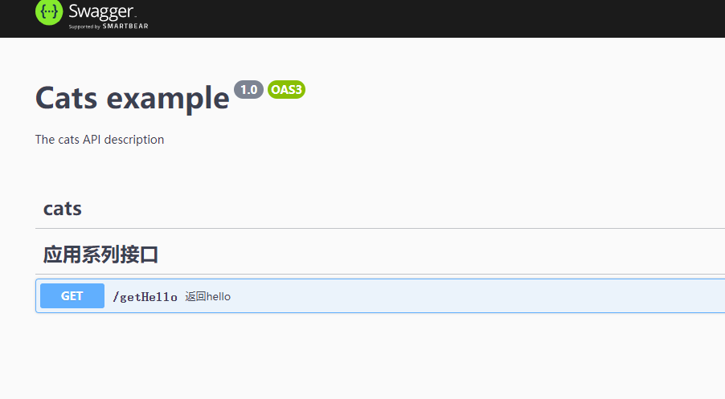
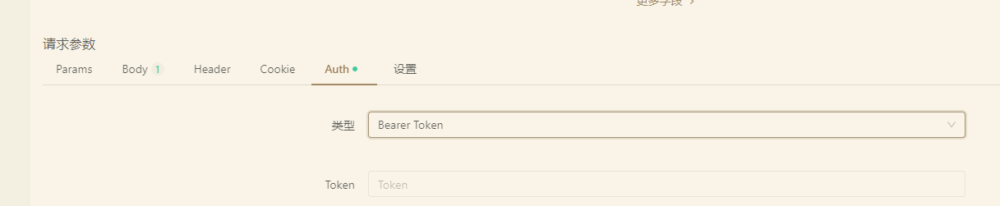
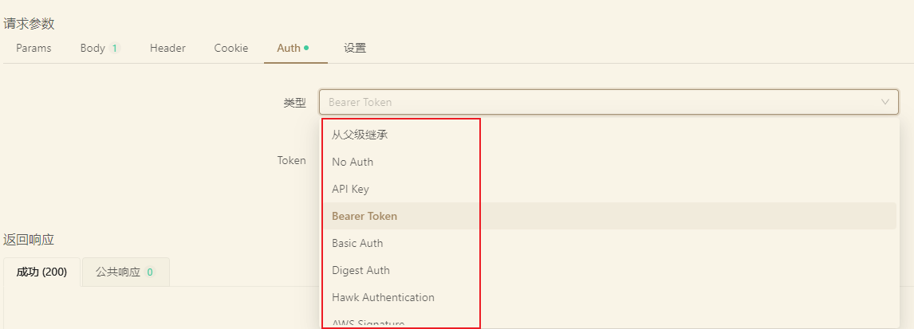
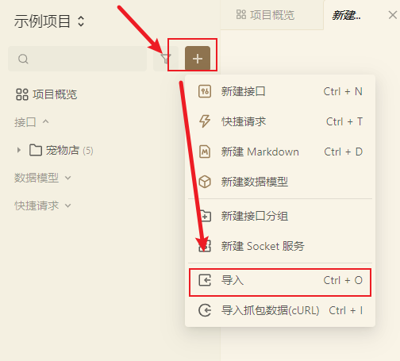
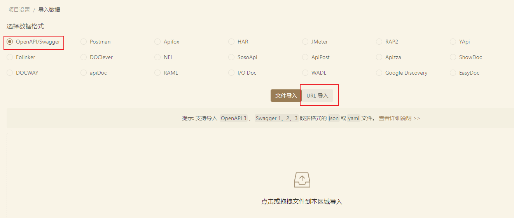
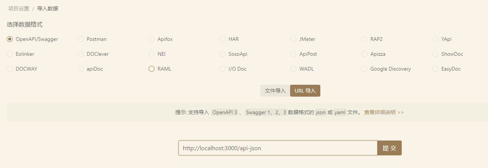
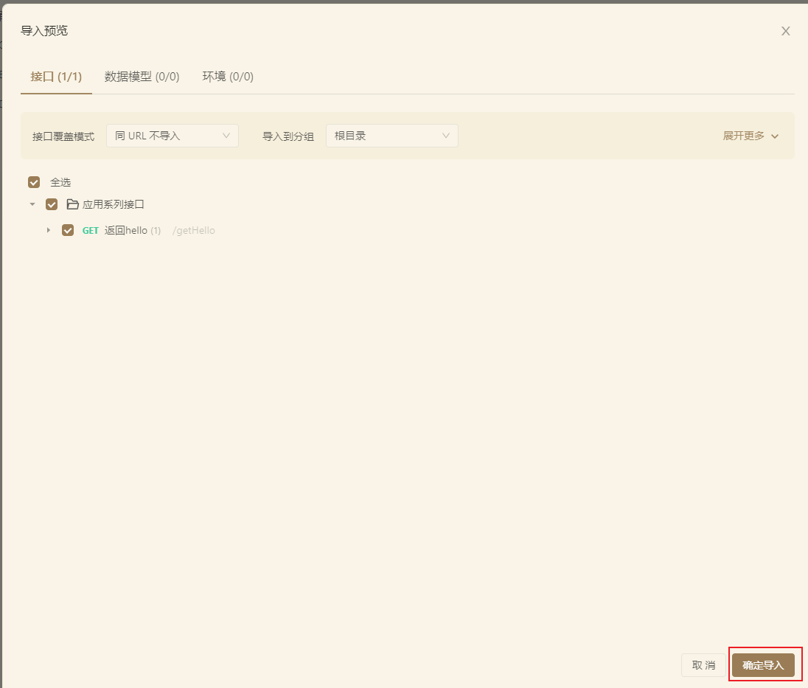
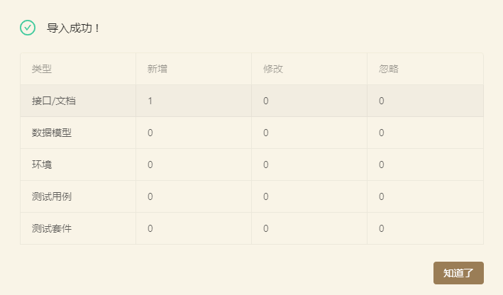
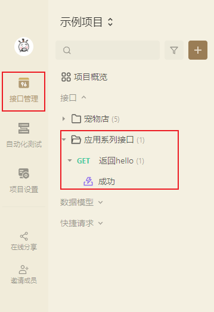

# nest笔记八：使用apifox导入swagger
- apifox是一个很不错的类postman工具，除了它国内还有不少类似的工具，我一个偶然的机会，就用它了, 目前使用来看，还不错。
- nestjs提供了对swagger的支持，我们只要按它的定义，就可以了
- nestjs的官方文档：https://docs.nestjs.com/openapi/introduction

## nest集成swagger
- 这个是基于现有的nestjs的项目的，如果你的项目不是基于它的，跳过
- 安装依赖库
```bash
$ npm install --save @nestjs/swagger
```
- 初始化，在main.ts加入初始代码(下面是官方实现)
```typescript
import { NestFactory } from '@nestjs/core';
import { SwaggerModule, DocumentBuilder } from '@nestjs/swagger';
import { AppModule } from './app.module';

async function bootstrap() {
  const app = await NestFactory.create(AppModule);

  const config = new DocumentBuilder()
    .setTitle('Cats example')
    .setDescription('The cats API description')
    .setVersion('1.0')
    .addTag('cats')
    .build();
  const document = SwaggerModule.createDocument(app, config);
  SwaggerModule.setup('api', app, document);

  await app.listen(3000);
}
bootstrap();
```
- 我的一个实现 main.ts， 我这里只是针对开发环境，才会有swagger，生产环境则不会提供。
代码在：https://github.com/zdhsoft/my_testlist/blob/main/nest/14_nest_template/src/main.ts， 这里有完整的实现
```typescript
import './init/init';
import { NestFactory } from '@nestjs/core';
import { AppModule } from './app.module';
import { getLogger } from 'xmcommon';
import { NestLogger } from './common/nest.logger';
import { RequestInterceptor } from './common/request.interceptor';
import { HttpFilterFilter } from './common/http_filter.filter';
import { NestExpressApplication } from '@nestjs/platform-express';
import session from 'express-session';
import path from 'path';
import { AuthGuard } from './common/auth.guard';
import { EnvUtils } from './env_utils';
import { ConfigUtils } from './init/config_utils';
import { ValidationPipe } from './common/validation_pipe';

const log = getLogger(__filename);
log.info('程序开始启动... 当前环境:' + EnvUtils.env + ' 开发环境:' + EnvUtils.isDev);
async function bootstrap() {
    const globalConfig = ConfigUtils.getConfig();

    const app = await NestFactory.create<NestExpressApplication>(AppModule, {
        logger: new NestLogger(),
    });
    app.use(session(ConfigUtils.buildSessionOptions()));
    // app.useStaticAssets(path.join(process.cwd(), 'public'), { prefix: '/static/' });
    app.useStaticAssets(path.join(process.cwd(), 'public'), {});
    app.setBaseViewsDir(path.join(process.cwd(), 'view')); // 放视图的文件
    app.setViewEngine('ejs');
    app.useGlobalPipes(new ValidationPipe());
    app.useGlobalInterceptors(new RequestInterceptor());
    app.useGlobalFilters(new HttpFilterFilter());
    app.useGlobalGuards(new AuthGuard());

    if (EnvUtils.isDev) {
        // 如果是开发模式，则加载文档
        // eslint-disable-next-line @typescript-eslint/no-var-requires
        const { DocumentBuilder, SwaggerModule } = require('@nestjs/swagger');
        const config = new DocumentBuilder()
            .setTitle('Cats example')
            .setDescription('The cats API description')
            .setVersion('1.0')
            .addTag('cats')
            .build();
        const document = SwaggerModule.createDocument(app, config);
        SwaggerModule.setup('apidoc', app, document);
        log.info(`swagger url: http://localhost:4000/apidoc`);
    }

    await app.listen(4000);
    log.info(`开始侦听:4000...`);
}
bootstrap();

```
- 在app.controller.ts 增加一个注入信息

```typescript
import { Controller, Get } from '@nestjs/common';
import { ApiOperation, ApiResponse, ApiTags } from '@nestjs/swagger';
import { AppService } from './app.service';

@ApiTags('应用系列接口')
@Controller()
export class AppController {
    constructor(private readonly appService: AppService) {}

    @Get()
    @ApiOperation({ summary: '返回hello' })
    @ApiResponse({ type: String })
    getHello(): string {
        return this.appService.getHello();
    }
}

```
- 然后执行
```bash
$ run run start
```
- 成功运行后， 可以在浏览器打开: http://localhost:3000/api
下图就是我们显示的结果



## swagger的一些装饰器
- 这里例举了常用的一些装饰器
### @ApiTags
- 用于标记controller名称
```typescript
@ApiTags('登录相关接口')
@Controller('login')
export class CLoginController {}
```
### @ApiProperty 和  @ApiPropertyOptional
- 用于描述属性
- ApiPropertyOptional 则表示这个属性可能不存在
- 示例：
```typescript
        @ApiProperty({ title: '手机号', maxLength: 11, minLength: 11 })
```
### @ApiBearerAuth
- 用于描述是什么鉴权方式，在apifox的请求参数中有一栏:Auth，其中有一个类型是Bearer Token，除此之外，还有其它的
```typescript
@ApiBearerAuth('JWT')
```
- 下图是apifox的效果
  - apifox的请求参数

  - auth类型列表


### @ApiOperation
- 这个是对请求方法的描述
```typescript
@ApiOperation({ summary: '使用验证码登录', description: '要求先获得验证码' })
```
### @ApiResponse 和 @ApiOkResponse
- 这个是响应类的装饰器, 有很多种
```typescript
    // 登录返回的VO
    @ApiTags('登录返回的VO')
    export class XDoLoginVO extends XRetVO {
        @ApiProperty({ title: '具体返回的数据 ' })
        data?: XTokenInfo;
    }
    // 使用验证码登录的请求参数
    @ApiTags('使用验证码登录的请求参数')
    export class XDTODoLogin {
        @ApiProperty({ title: '手机号', maxLength: 11, minLength: 11 })
        mobile: string;
        @ApiProperty({ title: '验证码', maxLength: 8, minLength: 1 })
        code: string;
    }
    // 登录请求
    @Post('login')
    @ApiOperation({ summary: '使用验证码登录', description: '要求先获得验证码' })
    @ApiOkResponse({ type: XDoLoginVO })
    private async doLogin(@Body() paramBody: XDTODoLogin) {
        const r = new XCommonRet();
        do {
            const result = (await this.user.adminLogin(
                paramBody.mobile,
                paramBody.code,
            )) as XCommonRet<ITokenString>;
            r.assignFrom(result);
        } while (false);
        return r;
    }
```
- 下面是响应类的装饰器，我目前还没有用到
```typescript
@ApiOkResponse()
@ApiCreatedResponse()
@ApiAcceptedResponse()
@ApiNoContentResponse()
@ApiMovedPermanentlyResponse()
@ApiFoundResponse()
@ApiBadRequestResponse()
@ApiUnauthorizedResponse()
@ApiNotFoundResponse()
@ApiForbiddenResponse()
@ApiMethodNotAllowedResponse()
@ApiNotAcceptableResponse()
@ApiRequestTimeoutResponse()
@ApiConflictResponse()
@ApiPreconditionFailedResponse()
@ApiTooManyRequestsResponse()
@ApiGoneResponse()
@ApiPayloadTooLargeResponse()
@ApiUnsupportedMediaTypeResponse()
@ApiUnprocessableEntityResponse()
@ApiInternalServerErrorResponse()
@ApiNotImplementedResponse()
@ApiBadGatewayResponse()
@ApiServiceUnavailableResponse()
@ApiGatewayTimeoutResponse()
@ApiDefaultResponse()
```
## 使用apifox导入
- 每次都用apifox更新接口文档是一个很痛苦的事情，还好有可以导入
- apifox可以支持很多种导入，这里只针对nestjs集成的swagger

  - 用apifox创建一个项目后，再点导入
  

  - 显示导入选择框，可以看到apifox集居了很多种格式的导入, 这里选择OpenAPI/Swagger和URL导入
  

  - 选择URL试，输入URL http://localhost:3000/api-json
  

  - 然后会弹出导出导入预览，第一次导入默认就可以了，然后点确认导入
  

  - 完后会弹出一个导入成功的按钮
  

  - 最后点在接口管理，就可以看到你导入的接口了
  

- 这样我们就完成了导入

## 相关文章列表
- [nestjs系列笔记](https://zdhsoft.blog.csdn.net/article/details/121746302)
