# vscode推荐插件20220901
- 从20217年使用vscode开发nodejs后端以来，也差不多满五年了。时间过的真快。
- 下面的是这段时间使用vscode之后，我觉得值得推荐的插件。
- 废话不多说，下面开始。按名称字母排序

## Add jsdoc comments
- 为选定函数签名的参数添加简单的 jsdoc 注释
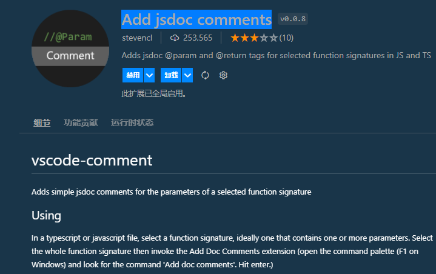

## Better Align
- 用冒号（:）、赋值（=、+=、-=、*=、/=）和箭头（=>）对齐你的代码。 它对逗号优先的编码样式和尾随注释有额外的支持。
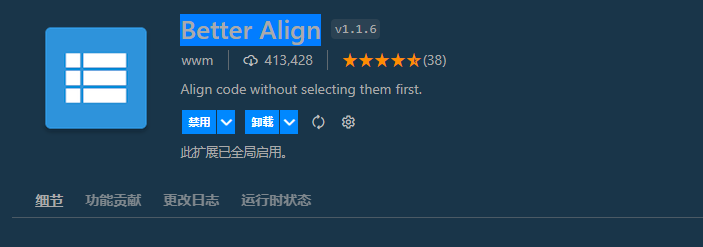

## Bookmarks
- 顾名思义书签，对于常期开发大规模项目来说，还是很有帮助的

## change-case
- 改变当前单词大小写的的插件，很有必要
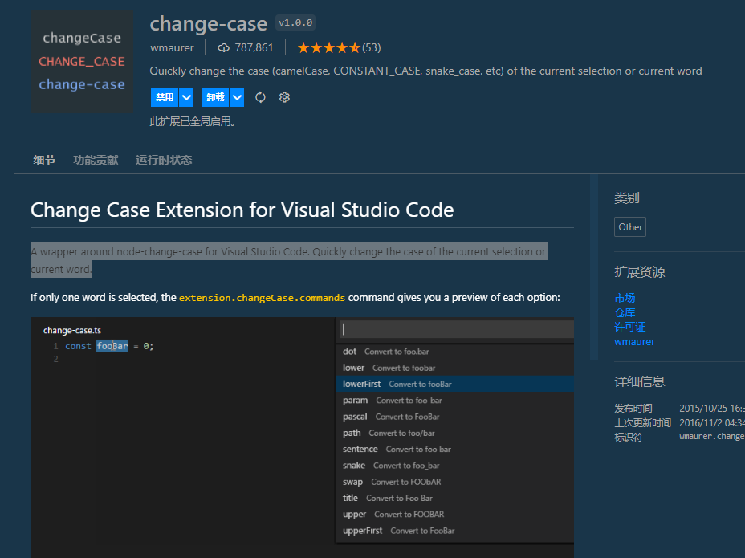

## Clipboard Manager
- vscode的剪切板管理器，很不错，很实现，强烈推荐

- 安装完成后，在左侧功能面版，会多一个图标，点开始后，就有很多历史的复制记录

## Error Lens
- 一个实时错误提的插件，强烈推荐
- 在编写代码的过程中，会把检查错误同步显示在相应行的后面。不用去错误列表去看了。
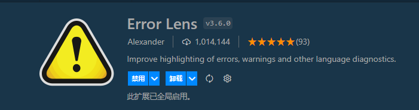

## ESLint
- 不用说，估计很多写Typescript或javascript的朋友，都会安装它。强烈推荐
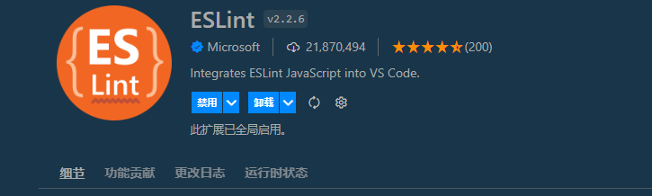

## GitLens — Git supercharged
- 可以显示当前编辑环境，显示哪些代码是谁提交的。还有注释，功能强大。好像有部分功能，开始收费了。但是绝大多数免费功能完全够用。
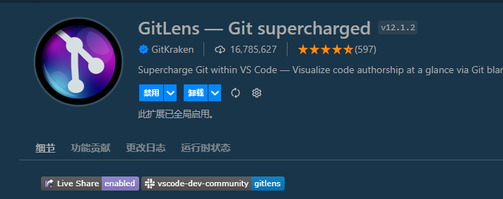

## indent-rainbow
- 用不同颜色显示tab缩进的插件
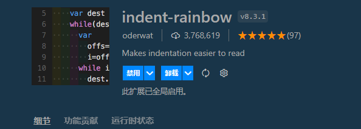
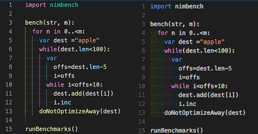

## MySQL
- 可以一定程度上替代navicat，还算比较方便。
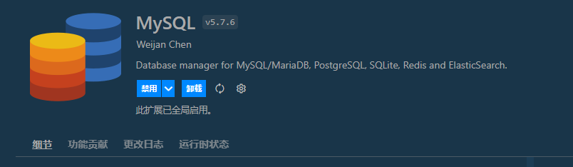

## MySQL Syntax
- 一个MySQL语法高亮插件
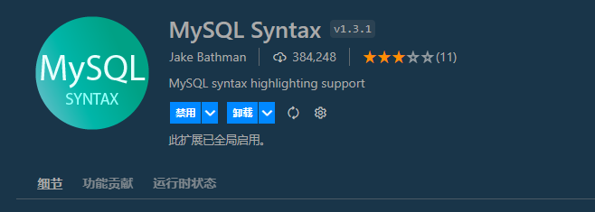

## NGINX Configuration
- 一个nginx配置的语法高亮插件，经常配置nginx的话，还是蛮方便的
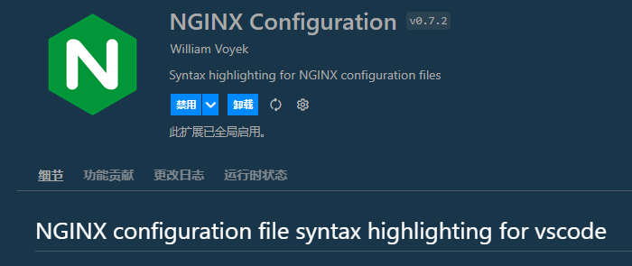

## NGINX Configuration Language Support
- nginx配置文件的代码提示与完成插件
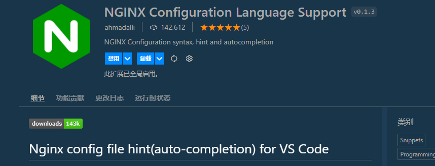

## nginx-formatter
- nginx配置文件格式化插件

## node-readme
- 一个显示node_module模块readme的插件，推荐安装，这样就可以老是跳到对应目录打开readme，省不少事。
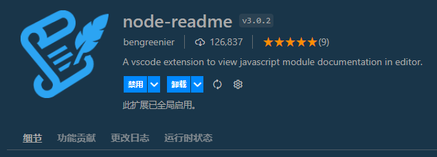

## npm Intellisense
- 一个自动完成包引用的插件
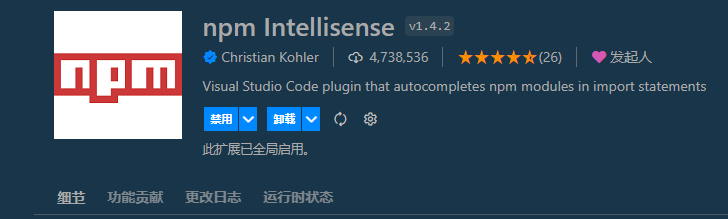

## Prettier ESLint
- 一个配合ESLINT插件代码格式化和检查的插件
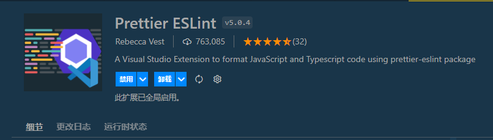

## Remote Development
- vscode的远程开发插件，强烈推荐。可以远程连接linux和wsl。远程调试，非常方便。
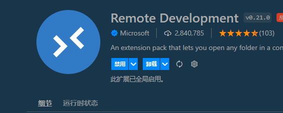

## Settings Sync
- Vscode配置远程保存的插件，非常适合多个开发环境或者换系统的时候，非常方便。

## Window Colors
- 有时候会同时打开多个vscode开发，但是界面差不多，容易搞混，使用这个插件，就可以解决了这个问题了。每个vscode都有不同颜色的侧边框，很方便。

## YAML
- 一个YAML高亮的提示的插件。
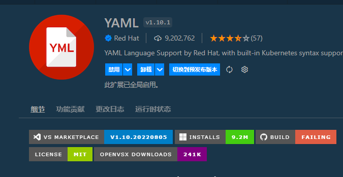

除了这些插件，还有很多插件, 一类是主题类，一类是文件图标类，后再我再补充
